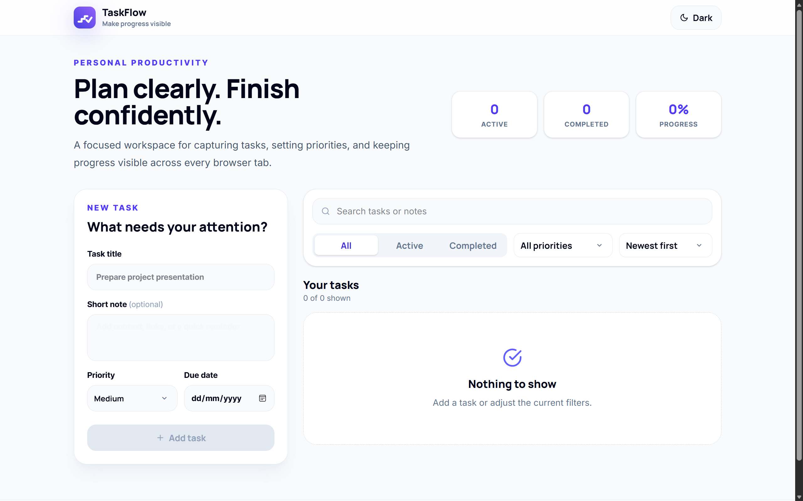
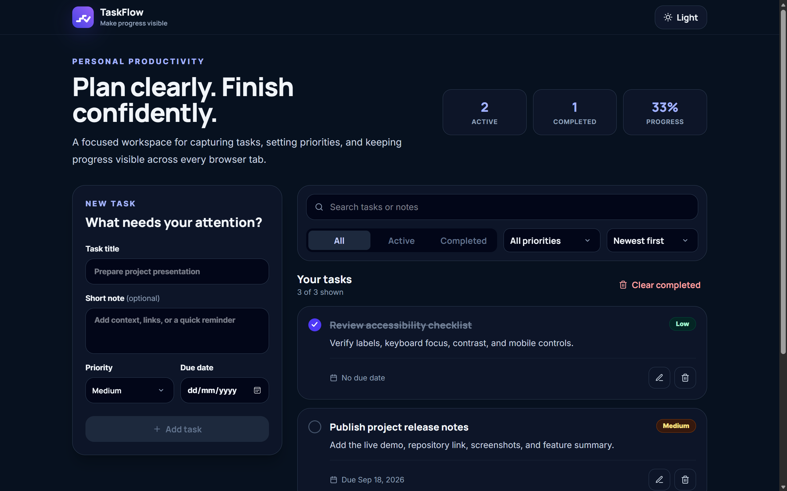

<p align="center">
  
</p>

<p align="center">
  A responsive, local-first personal task manager for organizing priorities, due dates, notes, and everyday progress.
</p>

<p align="center">
  <a href="https://taskflow-personal-task-manager.vercel.app"><strong>Live Demo</strong></a>
</p>

## Overview

TaskFlow is a browser-based personal task manager built with React, Vite, and Tailwind CSS. Tasks stay in the browser through localStorage and synchronize across open tabs on the same origin.

> [!NOTE]
> TaskFlow does not use accounts, a backend, or cloud synchronization. Clearing browser storage removes saved tasks.

<table>
  <tr>
    <td width="50%" valign="top">
      <a href="./public/screenshots/taskflow-light.png">
        
      </a>
    </td>
    <td width="50%" valign="top">
      <a href="./public/screenshots/taskflow-dark.png">
        
      </a>
    </td>
  </tr>
</table>

## Features

- Create, edit, complete, and delete tasks
- Optional notes, priorities, and due dates
- All, Active, and Completed views
- Search by task title or note
- Filter by priority
- Sort by newest, oldest, due date, or priority
- Active, completed, and progress statistics
- Clear completed tasks in one action
- Local browser persistence with corrupted-data recovery
- Cross-tab task synchronization
- Persistent light and dark themes
- Responsive desktop, tablet, and mobile layouts
- Accessible labels, focus states, status updates, and touch targets
- Reduced-motion support

## Technology Stack

- React 19
- Vite 7
- Tailwind CSS 4
- JavaScript
- React Icons
- Manrope and Inter through Fontsource
- Browser localStorage and Storage events

## Local Development

### Requirements

- Node.js 20.19 or later
- npm

### Install dependencies

```bash
npm install
```

### Start the development server

```bash
npm run dev
```

Open the local URL displayed by Vite.

## Validation

Run focused utility tests:

```bash
npm test
```

Run ESLint:

```bash
npm run lint
```

Create a production build:

```bash
npm run build
```

The focused tests cover task normalization, local persistence, corrupted-storage recovery, status filtering, search, due-date sorting, and priority sorting.

## Data and Privacy

TaskFlow stores task data only in the current browser origin under the `taskflow-tasks-v1` localStorage key. The selected theme is stored under `taskflow-theme`. No task data is sent to a server by this application.

## Responsive Behavior

- Desktop uses a two-column dashboard with a sticky task composer.
- Tablet uses a wide single-column layout with evenly distributed statistics.
- Mobile stacks task controls and filter dropdowns without horizontal page overflow.

## Branding

The TaskFlow logo, navigation mark, and favicon are original SVG assets created for this project. The mark represents ascending progress steps flowing into a check.

## Deployment

TaskFlow is prepared for deployment on Vercel using the Vite framework preset:

- **Build command:** `npm run build`
- **Output directory:** `dist`
- **Root directory:** `./`
- **Environment variables:** None required

**Live application:** [Open TaskFlow](https://taskflow-personal-task-manager.vercel.app)

## License

The source code is licensed under the [MIT License](LICENSE).

The TaskFlow name, logo, branding, and project screenshots are not licensed for reuse and may not be used to imply endorsement or affiliation.

## Author

**Neeraj Kumar Saini**
MERN Stack Developer

[GitHub](https://github.com/NeerajSaini271)
